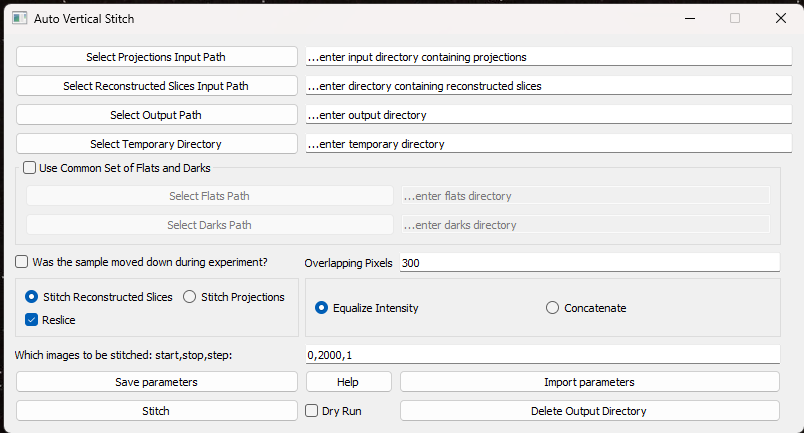

# Auto Vertical Stitch

This program is used to stitch together tomographic images. It was created to automate common workflow tasks when processing images after image acquisition.

Vertical stitching is necessary as overlapping image sets are created when the sample stage is moved up or down during image acquisition.



Created by Iain Emslie in 2022 for Jarvis Stobbs at the Canadian Light Source

## Setup

```sh
$ python -m venv stitchenv
$ source stitchenv/Scripts/activate
$ pip install requirements.txt
$ python auto_vertical_stitch_funcs.py
```

## Help

This tool is used to vertically stitch together overlapping images acquired
from parallel-beam CT, moving the sample stage vertically up or down between scans
of the rotated sample.

We assume an input directory structure of at least one or more `'CT'` directories.
Each CT directory will contain two or more z-view directories;
z-directories are sets of images acquired through horizontal sample rotation
, they vertically overlap with subsequent z-directories of the same parent CT-directory.

The program assumes that the images in each z-directory, within a parent CT-directory,
have the same overlap. The overlap is determined by FFT correlation
and edge-detection of corresponding images
from the middle two z-directories.

**'The Overlapping Pixels'** value should be around twice what they think the overlap is.

Default behaviour assumes that each z-view is higher than the previous.
If each z-view is lower than the previous then select **'Was the sample moved down during experiment'**

The program can vertically stitch either tomogram projections or reconstructed slices:
Projections are used to find the overlap so the **'Select Projections Input Path'**
must always point to a directory containing CT-directories.
To stitch projections select the **'Stitch Projections'** button.

Reconstructed Slices can be stitched by selecting the **Stitch Reconstructed Slices** button.
The **Select Reconstructed Slices Input Path** must be given a path to a directory
with the same structure as the **Select Projections Input Path** where each z-directory contains a single _'sli'_ subdirectory instead of `'tomo'` and the optional `'flats'`, `'darks'`, `'flats2'` subdirectories.

### There are two methods for stitching images:

**Equalize Intensity** will smoothly blend the overlapping images (like a crossfade).

**Concatenate** simply appends one image to the other.

Parameters can be saved to and loaded from .yaml files using the **Save Parameters** and
**Import Parameters** buttons.

The **Dry Run** checkbox makes the program find the pixel overlap for the projections input path but does not stitch images. This is useful for finding the correct settings.

Before running a stitch the program check that the output directory doesn't exist.
This is to reduce the chance of accidentally overwriting data.

The **Delete Output Directory** button allows for the deletion of the output directory.
